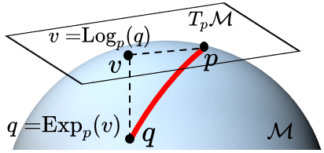
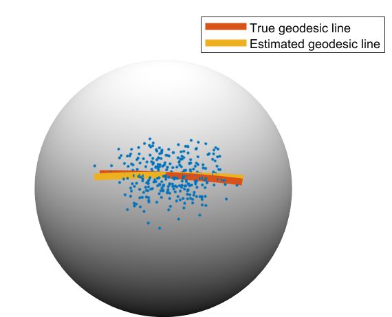
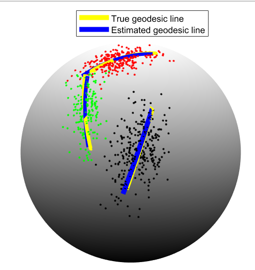
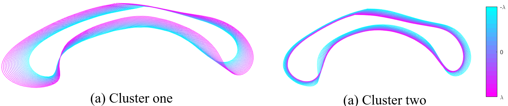

# Manifold-learning

This directory contains the code for manifold lerning, it has three demos: Demo_Sphere_PGA, Demo_Sphere_K_means_PGA and Demo_CC_K_means_PGA. They show the results of principal geodesic analysis (PGA) and K-mean PGA using 3D sphere and 2D corpus callosum data.

It includes two important concepts: Logarithmic (Log) map and Exponential (Exp) map, as shown in following figure

   

  

## Results

  

 Results of principal geodesic analysis (PGA) on sphere manifold 

  

 Results of K means PGA on sphere manifold 

  

 Results of K means of corpus callosum on Kendall's shape 

### Reference

If you find it is helpful, please cite it as:

`
[1]. Zhang, Youshan. "K-means principal geodesic analysis on riemannian manifolds." In Proceedings of the Future Technologies Conference, pp. 578-589. Springer, Cham, 2019.
`

`
[2]. Zhang, Youshan, and Brian D. Davison. "Deep Spherical Manifold Gaussian Kernel for Unsupervised Domain Adaptation." In Proceedings of the IEEE/CVF Conference on Computer Vision and Pattern Recognition, pp. 4443-4452. 2021.
`

`
[3]. Zhang, Youshan. "Bayesian Geodesic Regression on Riemannian Manifolds." BMVC, 2020.
`

`
[4]. Zhang, Youshan, Sihong Xie, and Brian D. Davison. "Transductive Learning Via Improved Geodesic Sampling." BMVC, 2019.
`

`
[5]. Zhang, Youshan, Jiarui Xing, and Miaomiao Zhang. "Mixture probabilistic principal geodesic analysis." In Multimodal Brain Image Analysis and Mathematical Foundations of Computational Anatomy, pp. 196-208. Springer, Cham, 2019.
`
